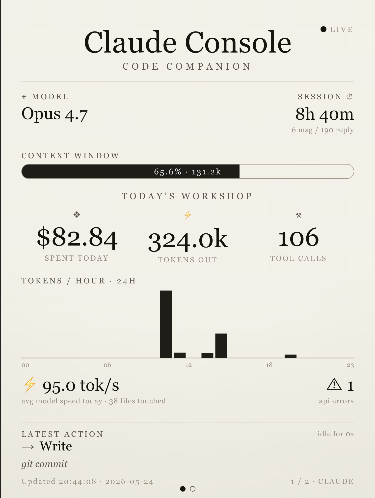
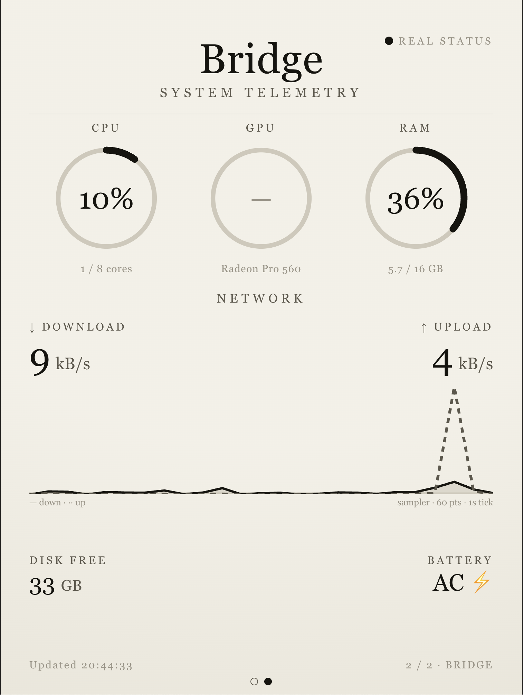

# Claude Console

English | [简体中文](./README.zh-CN.md)

An e-ink–style desktop dashboard that shows your **Claude Code usage** alongside **local system telemetry**. It renders two rotating portrait screens on a warm "paper" canvas — designed to live on a spare monitor or kiosk display next to where you work.

| Console — Code Companion | Bridge — System Telemetry |
| :---: | :---: |
|  |  |

## Features

- **Console screen** — model, active session duration, context-window usage, today's estimated cost / tokens out / tool calls, a 24-hour tokens-per-hour chart, average output speed, files touched, API errors, and the latest action.
- **Bridge screen** — CPU / GPU / RAM ring gauges, a live 60-point network sampler (down/up), free disk, and battery.
- **Hands-off display** — the two screens auto-rotate. Page manually by clicking the left/right edges or pressing `←` / `→`, or pin one screen with a URL query (see [Usage](#usage)).
- **All local** — usage is parsed from your own `~/.claude` transcripts and system stats are read on the host; nothing is sent anywhere.

## Requirements

- Node.js 18+ (Next.js 16).
- Run it on the machine where you use Claude Code, so it can read `~/.claude/projects/`.
- Works on macOS / Linux / Windows. Note: GPU utilization is often unavailable on macOS (the gauge then shows the model name without a percentage).

## Getting started

```bash
npm install
npm run dev      # http://localhost:3000
```

For production:

```bash
npm run build    # also the project's type-check / verification step
npm start
```

> There is no separate `lint` or `test` script — `npm run build` is the verification step.

## Usage

- **Auto-rotate:** screens flip every ~18s after the last interaction.
- **Manual paging:** click the left half → Console, right half → Bridge; or use `←` / `→`.
- **Pin a screen** (handy for a kiosk): `http://localhost:3000/?screen=bridge` or `?screen=console`.

## LAN / multi-device access

This is a **central dashboard**: every device that opens it sees the *host machine's* data — the Console screen shows that host's Claude Code usage, and the Bridge screen shows that host's system stats (not the viewing device's).

To reach it from other devices on your network:

1. **Run it in production mode** (recommended for an always-on display):
   ```bash
   npm run build
   npm run start:lan   # = next start -H 0.0.0.0
   ```
2. **Open it from another device** at the host's LAN address, e.g. `http://192.168.50.73:3000` — not `localhost`.

Tips:

- To survive DHCP address changes, give the host a reserved IP or use its mDNS name: `http://<hostname>.local:3000`.
- **Using `npm run dev` across devices?** Next.js returns `403` for its dev-only assets (HMR, overlay font) when requested from a non-`localhost` origin. Add each accessing IP to `allowedDevOrigins` in `next.config.ts` and restart. Production mode (`start`) has no such restriction.

### E-ink devices (Kindle, etc.)

Old e-ink browsers (e.g. the Kindle "Experimental Browser") can't run the React client or the container-query CSS the main dashboard relies on, so `/` shows up blank/unstyled there. Open **`/e`** instead — a server-rendered, **no-JavaScript** view that bakes the data straight into the HTML, auto-refreshes every 60s, and alternates between the Console and Bridge screens. Example: `http://192.168.50.73:3000/e`.

## How it works

```
client (app/page.tsx, polls)
  ├─ GET /api/claude  → lib/claude-stats.ts   reads ~/.claude/projects/**/*.jsonl
  └─ GET /api/system  → lib/system-stats.ts   reads the OS via `systeminformation`
```

- **Claude stats** are computed by scanning recent (last ~2 days) JSONL transcripts under `~/.claude/projects/`, parsing each line into session / today / context aggregates. Results are cached for ~10s.
- **System stats** come from the [`systeminformation`](https://www.npmjs.com/package/systeminformation) package. A background 1-second sampler keeps a rolling 60-point network series.

### Cost is estimated

The transcripts do **not** record per-message cost, so the "spent today" figure is **estimated** by multiplying token counts against a price table in [`lib/pricing.ts`](./lib/pricing.ts). Edit the `RATES` table there to match your own plan.

## Project layout

```
app/
  page.tsx            # client dashboard: polling, paging, auto-rotate
  layout.tsx          # root shell + metadata
  globals.css         # the e-ink design system (CSS container + cq* units)
  api/claude/route.ts # GET /api/claude
  api/system/route.ts # GET /api/system
components/           # ConsoleScreen, BridgeScreen, gauges, charts
lib/
  claude-stats.ts     # parse ~/.claude transcripts (server-only)
  system-stats.ts     # read OS via systeminformation (server-only)
  pricing.ts          # editable cost rate table
  format.ts           # client-safe formatting helpers
  types.ts            # ClaudeStats / SystemStats — the server↔client contract
misc/images/          # the two reference design mockups
```

## Tech stack

Next.js 16 (App Router) · React 19 · TypeScript · `systeminformation`.
